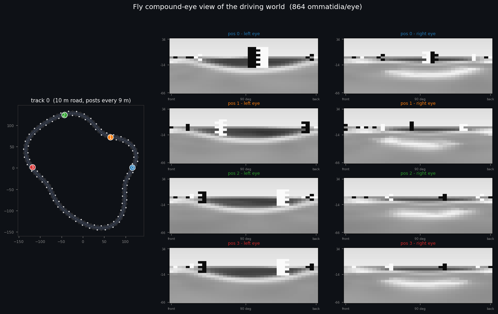
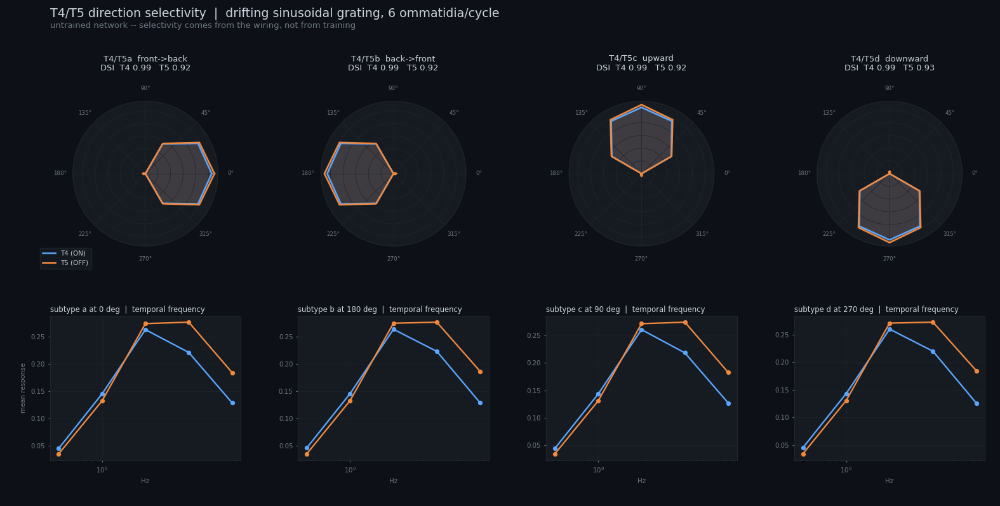
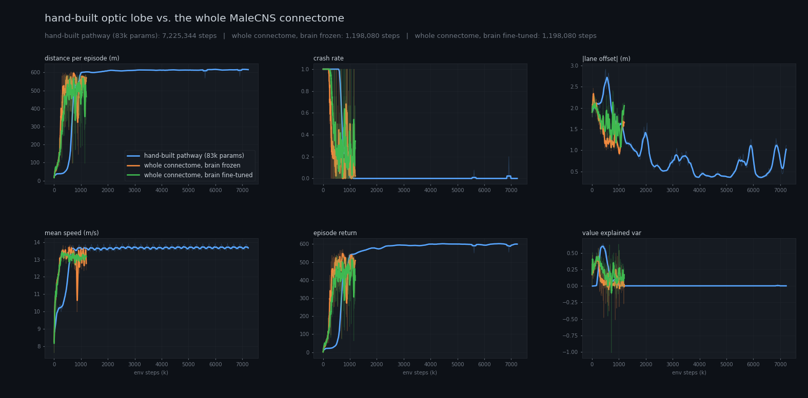
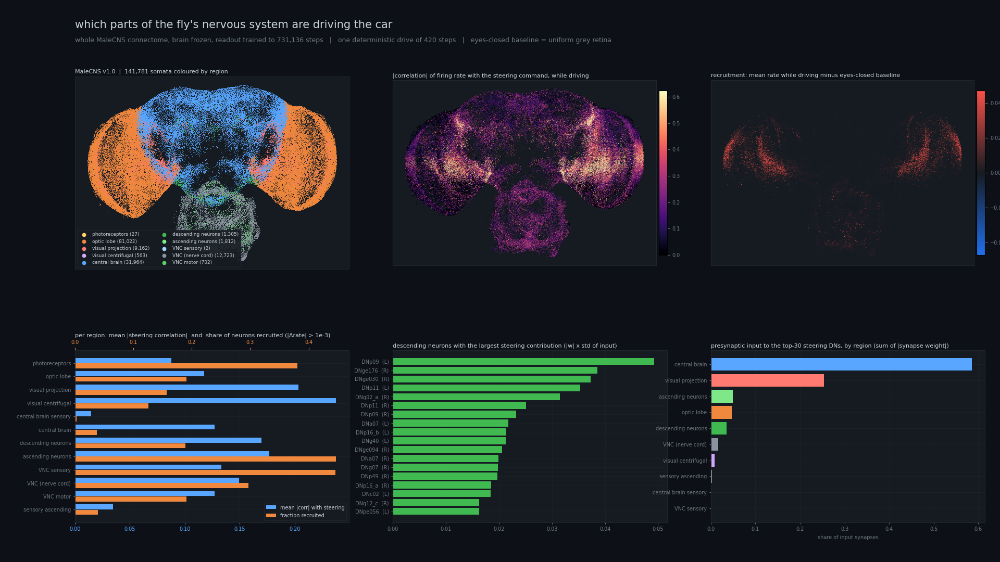
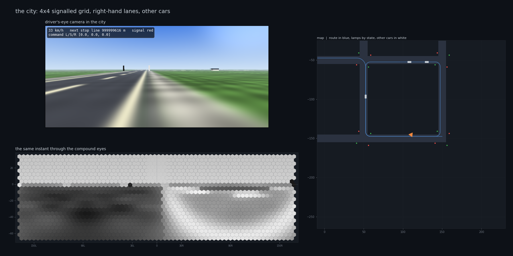
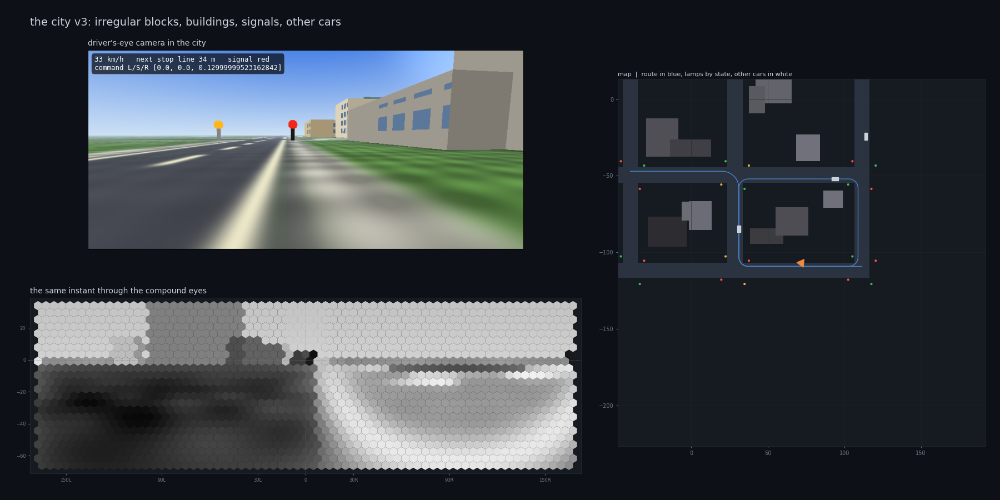
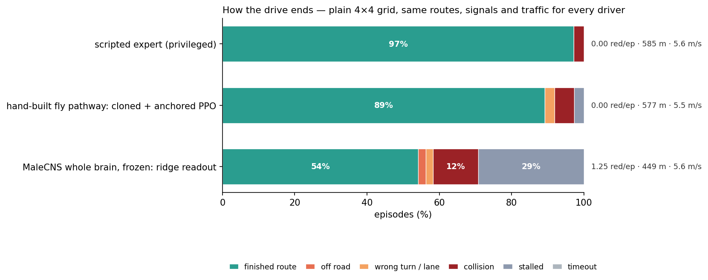
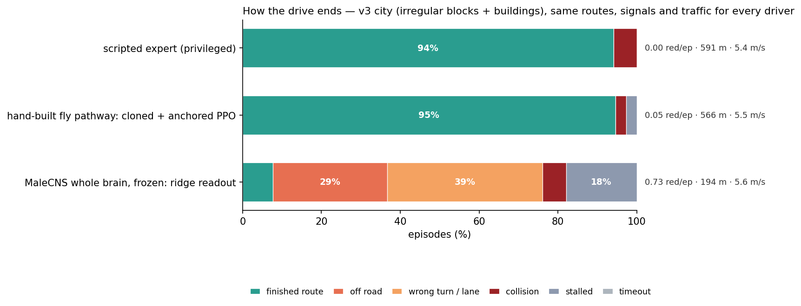

# flydrive — a fruit-fly visual system learning to drive

A *Drosophila* optic lobe, central complex and premotor stage, wired the way the
fly literature describes them, driving a car around a procedurally generated
track in a virtual world. The agent sees nothing but 1728 ommatidia; there is no
map, no lane offset, no track geometry in the observation.



## Why this shape

The connectome records *which* neurons connect and how many synapses they share.
It records no synaptic gain and no plasticity rule, so a connectome cannot be
"run" as a policy. The working compromise — the same one
[flyvis](https://github.com/TuragaLab/flyvis) (Lappalainen et al., *Nature* 2024)
makes — is to take the **wiring as a structural prior and learn the weights**.

That is what this repo does, at a scale that fits a single GPU and a control task
with a closed loop:

```
R1–R6 photoreceptors        864 per eye on a hexagonal lattice, Gaussian
                            acceptance angle, local contrast adaptation
  ↓
lamina        L1 (ON)  L2 (OFF)  L3 (sustained)        half-wave rectified
  ↓
medulla       Mi1 Tm3 Mi4 Mi9   (ON)     each a first-order temporal filter
              Tm2 Tm1 CT1 Tm9   (OFF)    with its own learnable time constant
  ↓
T4 a/b/c/d (ON)   T5 a/b/c/d (OFF)
              Hassenstein–Reichardt correlators: the fast centre signal is
              multiplied by the delayed signal one lattice step upstream, the
              mirror product is subtracted, and a sign-inverting third arm
              suppresses null-direction motion
  ↓
lobula plate  HS ×3 and VS ×10 per eye — wide-field integrators that compress
              13 824 motion units into 26 numbers
lobula        a columnar pool that keeps coarse retinotopic *position*, which
              HS/VS deliberately throw away
  ↓
central       EPG ring attractor (16 wedges, FFT phase-shift + Mexican-hat
complex       recurrence, anchored by ring-neuron visual input)
              PFL3 — compares the heading bump against a goal direction
  ↓
descending    DNa01/DNa02-like premotor pool
  ↓
steering, throttle
```

83 182 parameters in total. The structure is fixed; PPO learns the weights.

## The motion detectors actually work

Before any training, drifting-grating tuning curves measured the same way as in
electrophysiology:



Direction-selectivity index **0.98 (T4)** and **0.89 (T5)**, each subtype tuned to
its own cardinal direction, and band-pass temporal-frequency tuning peaking near
2–4 Hz. None of that is trained — it falls out of the wiring.

Getting there took three fixes worth recording, because each one silently
flattened the tuning:

| symptom | cause | fix |
| --- | --- | --- |
| DSI 0.02 | `softplus` in the lamina leaves a 0.69 pedestal on every cell | half-wave rectify with `relu` |
| DSI 0.17 | the three arms were summed *linearly*, so there is no correlation | multiply centre × delayed-upstream (a real HR detector) |
| responses pinned near the floor | `softplus(4x)/4` at the T4/T5 output reintroduces a 0.17 pedestal | `relu` |

## The world

Rendered analytically on the GPU — ray/plane intersection plus angular extent
tests, no rasteriser — so 256 environments step together at ~10 000 env-steps/s:

* a textured ground plane, pre-filtered by each ommatidium's footprint so distant
  ground does not alias into the motion detectors,
* a road with solid edge lines and a dashed centre line (the dashes stream past
  and give the correlators an unambiguous longitudinal signal),
* alternating light/dark posts every 9 m along both edges,
* distance haze, and a kinematic bicycle model for the car.

## Two models, one task

`--model fly` runs the hand-built pathway above. `--model cns` runs **the whole
released connectome** instead.

### The whole MaleCNS connectome as the policy

[MaleCNS v1.0](https://male-cns.janelia.org/) (Janelia FlyEM, Cambridge, MRC LMB
and Google Research; *Cell*, 2026) is the first complete male *Drosophila*
central nervous system — brain, optic lobes, neck connective and ventral nerve
cord. `flydrive/wholebrain.py` loads it and runs it as the driving policy:

| | |
| --- | --- |
| neurons | **162,432** (reconstructed well enough to simulate) |
| synapses | **24,380,527 edges / 119,996,752 synapses**, none of them learned |
| signs | from the released neurotransmitter predictions — ACh excites, GABA and glutamate inhibit (fly glutamate gates GluCl), histamine inhibits |
| light enters at | 5,708 neurons: 1,317 photoreceptors, plus L1/L2/L3 for every column the retina reconstruction does not cover |
| motor comes out of | the **1,311 descending neurons**, read by one linear layer |
| learnable | **674,129** parameters — a membrane time constant, gain and bias per neuron, one synaptic gain per cell type, and the input and output maps |

The adjacency matrix is fixed. What is learned is only what a connectome cannot
tell you: single-neuron dynamics, and how the world is plugged in at either end.

Two practical notes, both of which took a run to find:

* **Raw synapse counts diverge.** Mean in-degree is 150, so a unit-weight loop
  has a gain of order 100 and the network NaNs within a few steps. Normalising
  each neuron's total input drive to 1 keeps the *relative* strength of its
  inputs — the part the connectome measures — and is stable. A saturating
  firing rate caps the loop.
* **The backward pass needs a precomputed transpose.** Letting autograd
  transpose a 24-million-edge CSR matrix every step costs more than the
  multiplication; `SpMM` stores `Wᵀ` and the backward is one more spmm.

* **The readouts need centred inputs and their own learning rates.** A linear
  probe of the *untrained* descending neurons recovers lane position at R² 0.83
  once features are centred per neuron — but only 0.34 in the LayerNorm form a
  naive readout sees, and both the critic and the actor sat on that flat floor
  for hundreds of thousands of steps. Per-feature running statistics fix it
  (deferred to between iterations for the actor, so the PPO ratio stays exact);
  the brain's 486k single-neuron parameters then get a 10× smaller rate than
  the 2.6k readout weights, or one coherent step blows the KL to 3.
  `scripts/train.py --model cns --trunk-lr-scale 0.1 --motor-lr-scale 1.0`.

Two runs are worth having: `--trunk-lr-scale 0.0` freezes the brain entirely and
trains only the readout, which is the cleanest test of what the wiring provides;
`0.1` lets the single-neuron parameters adapt on top.

Honest expectation: most of those 162,432 neurons are olfactory, gustatory,
courtship and flight-motor circuitry that receives nothing from a driving task
with only visual input. Running the whole thing does not make the model *more*
fly — it asks a narrower question, which is whether connectome topology is a
better prior than random sparse connectivity of the same size. The point is to
run it and report what happens.

## Results

One seed each; the two whole-connectome runs share a seed and so see the same
sequence of tracks. Last 12 iterations of each run:

| | env steps | distance / episode | crash rate | lane offset | first crash-free window |
| --- | ---: | ---: | ---: | ---: | ---: |
| hand-built pathway (83k params) | 7.2M | **617 m** | **0.00** | **0.70 m** | 1.11M |
| whole connectome, brain frozen | 1.2M | 557 m | 0.06 | 1.63 m | **0.74M** |
| whole connectome, brain fine-tuned | 1.2M | 495 m | 0.23 | 1.93 m | never sustained |

At a matched budget of 740k steps the ordering is different: hand-built 445 m /
crash 0.45 / 1.98 m; frozen connectome **595 m / 0.00 / 1.19 m**; fine-tuned
545 m / 0.12 / 1.34 m.



What this does and does not show:

* **The untrained wiring is a better prior than the hand-built pathway.** A
  linear readout of 1,311 descending neurons on top of the frozen MaleCNS graph
  reaches crash-free driving in 0.74M steps; the hand-built optic lobe needs
  1.11M. A ridge probe of the untrained descending neurons already recovers
  lane position at R² 0.83.
* **It is not more precise.** Given six times the steps, the hand-built model
  holds the lane at 0.70 m against the connectome's 1.6 m, and the connectome
  runs were still noisy at the end of their budget.
* **Fine-tuning the brain hurt.** Letting the 486k single-neuron parameters
  move at 3e-5 left the readout chasing a drifting representation: 495 m and
  0.23 crashes against 557 m and 0.06 with the brain frozen.
* **It costs 25× more per step** (218 vs 5,305 env-steps/s on this MIG slice):
  the hand-built model is crash-free in about four minutes of wall clock, the
  connectome in about seventy.
* Both connectome runs dipped together near 845k steps — same seed, same hard
  stretch of track — which is a reminder that these are single-seed numbers.

## Which parts of the brain are driving

`scripts/brain_map.py` records every neuron's firing rate through one drive of
the frozen-brain policy, compares it with an eyes-closed baseline (uniform grey
retina), and paints the result onto the reconstruction's soma positions —
141,781 of the 162,432 neurons have one.



* Steering-correlated activity sits along the medial edge of both optic lobes
  and in a band across the central brain; recruitment relative to eyes-closed
  is strongest at the lateral rim of the lobes, where light enters.
* The thirty descending neurons that carry most of the steering command take
  **58 % of their input synapses from the central brain** and 25 % from visual
  projection neurons — the visual signal reaches the motor output through
  central-brain circuits, not directly from the optic lobe.
* `--video` writes `runs/brain_activity.mp4`: the driver's camera beside the
  soma cloud, coloured frame by frame by rate change.

## The city

`--env city` swaps the closed loop for a 4×4 grid of two-way roads
(`flydrive/city.py`, `flydrive/env_city.py`): signalled intersections, a random
route per episode, and six other cars.

* **Route and turn command.** Each episode draws a random walk over the grid
  (~12 intersections). The car keeps to the right-hand lane; corners are
  filleted (9 m right, 14 m left in the runs below) so the lane path is
  drivable. Three command channels — left / straight / right — ramp up over the
  last 40–70 m before a corner and then, inside the arc, carry the turn still
  to be made (1 → 0 across the 90°), the way a goal direction is compared with
  the heading in the central complex. The hand-built model reads them with its
  goal projection; the whole-connectome model injects them into **PFL3**, the
  fly's own steering-goal neurons (12 per side).
* **Signals.** Every approach has a lamp on a pole at the stop line; the phase
  alternates east–west / north–south on an 18 s cycle. The fly is achromatic,
  so state is luminance: pole and lamp at 0.98 (green), 0.55 (yellow), 0.06
  (red). Crossing the stop line on red costs −5; waiting at a red pauses the
  stall timeout.
* **Other cars.** Six cars per environment follow their own routes at ~8 m/s,
  brake for red, keep a speed-dependent gap behind whatever is ahead in their
  lane (v²/8 + 12 m — 12 m alone cannot be braked inside from 8 m/s), give way
  inside an intersection, and never respawn within 30 m of the fly. They are
  rendered as oriented boxes (exact ray/box intersection); touching one ends
  the episode as a crash.
* The renderer stays analytic: the road field is a closed-form function of the
  grid, so 64 environments still step at ~2,600 env-steps/s with cars and
  signals in view.
* **Two images from one geometry.** The fly's input is achromatic luminance
  (the hex mosaic); the driver's-eye camera is a separate colour pass over the
  same rays — sky gradient with a sun glow and a procedural cloud layer, kerb
  and sidewalk, dark asphalt with cream markings, red/amber/green lamps,
  building facades with a window grid (some panes catch the sky), storey
  ledges, a darker plinth and a lighter parapet, contact shadows, car paint —
  that never touches what the fly sees: the luminance image is bit-identical
  with and without the colour pass, so a policy trained before it existed
  drives exactly the same after it.



`--city-v3` adds irregular block sizes (60–140 m) and two to four box
buildings per block, set back 3 m from the kerb, 6–20 m tall. Buildings occlude
signals and other cars, which is most of what makes an intersection hard. The
road field stays closed-form (nearest road line by binary search), at about
1,100 env-steps/s for 64 environments with ten buildings in view.



Turn-following is the hard part. After 6M steps on the plain grid the
hand-built model leaves the road in only 3 % of episodes but takes the wrong
turn in 77 % — it drives one block and ignores the command. Reward shaping
(`--command-range 70 --wrong-turn-penalty 12 --w-heading 0.6`, corner-spawn
curriculum, a steering-direction bonus) changed nothing in 1.2M further steps:
a 90° corner needs steer ≈ 0.56 held for ~30 consecutive steps, and per-step
Gaussian exploration never produces it, so the policy never sees a successful
turn. `scripts/eval_city.py` separates off-road, wrong turn, collision, stall,
timeout and red-light runs so failure modes are never confused again.

### Getting the city right: a scripted expert and what it exposed

`flydrive/expert.py` is a privileged reference driver — pure pursuit on the
lane path, a braking curve the car can actually follow, stops held past the
line, creep-yield on left turns, a crawl when it shares an intersection. It
exists to answer "is a clean drive possible here at all?" and to teach. Making
it clean was the most productive part of the project, because every one of its
failures turned out to be the environment's:

1. **The route position was ambiguous.** Six-turn routes on a 4×4 grid revisit
   streets, and the nearest-route-point search was global, so the arclength
   flipped ~100 m between steps whenever the car was near an earlier leg.
   Phantom stop lines, ±5 m progress spikes, wrong-turn flags on the correct
   lane, and most of every model's "red runs" (0.5–1.5 per episode) were this
   one bug. The search is now local to the previous arclength.
2. **The turn command switched off when the turn began.** `next_corner`
   moved on to the *next* corner 1 m past the entry, so the command a policy
   receives vanished exactly as the 14–22 m fillet arc started; every learned
   policy had to hold a 90° turn from memory. A corner now stays current for
   25 m past its entry. Whole-brain wrong turns went from 70 % to 4 % from this
   change alone; the hand-built model's from 85 % to 19 %.
3. Other cars respawned anywhere, including on top of the fly; a 12 m following
   gap cannot be braked inside from 8 m/s; the stop-line crossing test re-fired
   every step for a car parked on the line; the 240 s episode limit cut off the
   last leg; queueing behind a stopped car counted as stalling; stopping early
   for a red counted as stalling.

Expert before the fixes: 84 % finish, 11 % collisions, 0.16 red/episode. After:
**98 % finish, 2 % collisions, 0 red runs, 0 stalls** (plain grid) and 94 % /
6 % / 0.09 in the v3 city with buildings. The diagnostic scripts that found all
of this — `scripts/diag_stalls.py`, `diag_collisions.py`, `diag_turns.py` —
classify every termination of any driver (expert or checkpoint) and print the
world state at the moment it happened; read the pose *before* `env.step`,
which respawns finished cars before it returns.

### Imitation, and what a fly eye cannot see

With exploration ruled out, both models are cloned from the expert
(`scripts/bc_warmstart.py` for the hand-built pathway — sequence BC on 32-step
windows, initialised from the lane-keeping RL policy, DAgger relabelling;
`scripts/bc_cns_ridge.py` for the whole brain — a closed-form ridge readout on
the 1,311 descending-neuron rates of the *frozen* connectome, DAgger mix capped
at 0.7, normal equations accumulated in chunks so the dataset never sits on the
MIG slice as one double matrix). Cloning *through* the whole brain by backprop
failed twice (10 m, 99 % off-road): the training and rollout statistics of a
162k-neuron rate network never match.

The clone's remaining failure was structural and worth stating plainly. The
photoreceptor adaptation (τ 0.6 s) turns any static scene into zero contrast
within about two seconds, and T4/T5 respond only to motion — so a car waiting
at a red light has **no visual input at all** after two seconds and must
remember the red through a 10 s phase with a 3 s BPTT window. Depending on how
the throttle loss was weighted the clone either stalled at green (the hold
decayed) or ran reds (the go decayed); no loss weighting could fix a
representation problem. Flies solve this with L3, the sustained, luminance-
encoding lamina cell (Ketkar et al. 2020); `brain.py` now feeds
`l3_lum_gain · (luminance − 0.5)` into the lobula columnar (object) pathway
only, leaving the motion pathway's contrast input — and the T4/T5 tuning check
— untouched. `scripts/diag_stalls.py` confirmed the lamp was never the problem:
at every stall the red-vs-green rendering differed in 15–58 ommatidia.

### City results

Same routes, signals and traffic for every driver (eval seed 123, 3,400 steps ×
32 environments, deterministic actions), after all the fixes above and the
fine-tuning described below. One hand-built policy drives both cities: it was
cloned and fine-tuned in the v3 city, then fine-tuned briefly on the plain grid.

| plain 4×4 grid | episodes | finished | off road | wrong turn / lane | collision | stalled | red runs / ep | distance |
| --- | ---: | ---: | ---: | ---: | ---: | ---: | ---: | ---: |
| scripted expert (privileged) | 36 | **97 %** | 0 | 0 | 3 % | 0 | **0.00** | 585 m |
| hand-built fly pathway, cloned + anchored PPO | 37 | **89 %** | 0 | 3 % | 5 % | 3 % | **0.00** | 577 m |
| MaleCNS whole brain, frozen, ridge readout (`bc_cns_v10`) | 48 | 54 % | 2 % | 2 % | 12 % | 29 % | 1.25 | 449 m |

The plain-grid hand-built row is the checkpoint the fair watcher selected on
the *average of two seeds* (123 and 21) and confirmed better than its
predecessor on each seed separately; single-seed picks had been optimistic by
10–15 points on held-out seeds. On the held-out seed 21 it finishes 83 % with
0 off-road, 3 % wrong turns, 6 % collisions, 8 % stalled and 0.03 red runs per
episode (its predecessor: 78 %, 17 % collisions). The remaining collisions are
mostly rear-ending a car that stopped ahead.

| v3 city: irregular blocks + buildings | episodes | finished | off road | wrong turn / lane | collision | stalled | red runs / ep | distance |
| --- | ---: | ---: | ---: | ---: | ---: | ---: | ---: | ---: |
| scripted expert (privileged) | 35 | **94 %** | 0 | 0 | 6 % | 0 | **0.00** | 591 m |
| hand-built fly pathway, cloned + anchored PPO | 37 | **95 %** | 0 | 0 | 3 % | 3 % | 0.05 | 566 m |
| MaleCNS whole brain, frozen, ridge readout (`bc_cns_v3city`) | 117 | 8 % | 29 % | 39 % | 6 % | 18 % | 0.73 | 194 m |

The v3 row is the multi-layout stage described below (four layouts in every
batch, on top of the earlier polish with exploration σ halved and a
closing-speed penalty toward the car ahead), selected on the average of two
seeds and better than its predecessor on each: on seed 123 it edges past the
expert's 94 %; on the held-out seed 21 it finishes 76 % with 0 off-road, 6 %
wrong turns, 12 % collisions and 0.25 red runs per episode (its predecessor:
70 %, 16 % wrong turns, 7 % collisions, 0.23 red runs). The residual failures in
both cities are intersection collisions, mostly rear-ending a car that has
stopped ahead, and on new layouts some creeping through reds.





* **Both models now follow the route.** Wrong turns went from 77–85 % to 0–4 %
  without any change to either model — it took the command staying on through
  the arc and then encoding the turn still to be made (1 → 0 across the 90°),
  the way a goal direction is compared with the heading in the central complex.
  For the frozen connectome, into PFL3, that one change took the finish rate
  from 3 % to 63 %.
* **The whole brain drives, but does not stop for lights.** A linear readout of
  1,311 descending-neuron rates keeps the road and the route but runs 1.3 reds
  per episode; the hold/launch decision is not linear in those rates (an MLP
  readout and every weighting we tried made it worse, not better).
* **The hand-built pathway stops for lights but hedges.** 0.26 red runs and no
  green-light stalls once L3 carries luminance, but 30 % of episodes still end
  stopped at a corner or behind nothing at all: the regression averages the
  expert's "creep" and "go" in states the eye cannot tell apart.
  Weighting the throttle loss toward launching trades one for the other
  (`bc_fly9`, weight 3: 63 % finish, 14 % stalled, but 0.65 red runs and 12 %
  wrong turns) — the stall/red-run axis is where the remaining error lives,
  and `bc_fly8` is the point on it we chose to report.
* Videos: `videos/city_final_all_small.mp4` (plain grid) and
  `videos/city_v3_final_all_small.mp4` (v3 city) — the pathway panel (eye
  mosaic, T4/T5, HS/VS, EPG ring, descending output) stacked over the driver's
  camera, the stage activity bars and the anatomical soma map of the same
  drive; `videos/city_cns_brain_small.mp4` (the whole connectome's soma cloud
  lit up frame by frame beside the driver's camera — `scripts/brain_map.py
  --city --video`); `videos/city_cns_final_small.mp4` (whole-brain driver's view).
  `scripts/fly_brain_map.py` answers "which parts of the brain is the
  hand-built model using?" anatomically: the real MaleCNS somas of the cell
  types it implements (R1–R6, L1–L3, Mi/Tm, T4/T5, HS/VS, EPG, PFL3, DNa) are
  lit by the model's own activity, frame by frame, beside the driver's camera.
  Both `*_final_all_small.mp4` videos stack the pathway panel over that
  anatomical view for one and the same drive (same seed, deterministic policy).
  `scripts/finalize.sh` re-renders all of them.

### Fine-tuning the clone with PPO: what finally worked

Cloning gets a policy that keeps the road and follows the route; the last
errors (hesitating at a corner, creeping through a red) are decisions the
regression averaged away. Reinforcement learning from that clone works only
with three things in place (`scripts/train.py --resume <clone> --bc-anchor …`):

1. **A critic warm-up.** The clone's value head is untrained; letting its
   advantages drive the actor wrecks the clone within twenty iterations
   (`--critic-warmup 30`: value head only, trunk gradients dropped).
2. **An anchor to the clone, per channel.** `||μ − μ_clone||²` on the same
   observations, weighted 200 → 80 over training, but ten times weaker on the
   throttle than on the steering (`--bc-anchor-throttle-scale 0.1`): the
   clone's steering is worth keeping, its throttle is what the reward must fix.
   Throttle exploration is widened to σ 0.35 for the same reason.
3. **A reward that actually forbids red runs.** A −15 crossing penalty is
   cheaper than the ~50 m of progress reward that waiting forgoes, so the
   optimum is to creep through; the crossing costs 60 and approaching a red
   within 15 m costs 0.5 × speed per step (`--red-penalty 60
   --red-approach-w 0.5`).

Every checkpoint is judged only by `scripts/fair_watch.py` — a fixed-seed
evaluation every 15 minutes that keeps `best_fair.pt` by driving outcome, never
by training return. On the plain grid this took the hand-built model from 56 %
to 74 % finished routes with stalls down from 30 % to 3 %. In the v3 city with
buildings, ten DAgger rounds followed by the same fine-tune reached **86–89 %
finished, 0 off-road, 0 wrong turns, 0.03–0.11 red runs per episode** — the
scripted expert scores 94 % there. The policy trained in the v3 city also
drives the plain grid better than anything trained there (79 % straight off,
91 % after a short fine-tune on the plain grid): buildings make the better
curriculum. The whole-brain readout could not be fine-tuned this way — a
1,311-weight linear readout over standardised, ±10-clipped rates changes its
output by tenths per Adam step even at lr 1e-5, and PPO diverges before the KL
stop can act (`--freeze-actor-norm` keeps its input statistics fixed but does
not fix this) — so the whole-brain result is the ridge clone.

A last round of DAgger relabelling *from* the fine-tuned policies followed by
the same anchored PPO (both cities) did not beat these checkpoints on a
two-seed average: relabelling restores clean turning but brings back creeping
through reds (0.9–1.1 per episode), and PPO recovers only to a tie on the plain
grid (86 % finished, 0.14 red runs vs 82 % / 0.00). Representatives are chosen
on the average of two seeds, ties going to fewer red runs.

Two further levers aimed at the held-out gap were tried last (stage 11, both
cities, 12 M steps from the representatives): **domain randomisation** — the
trainer rebuilds the city from a fresh seed every 30 iterations
(`CityEnv.reseed`, `--reseed-every 30 --seed-pool 1000 1100`, the evaluation
seeds kept outside the pool) — and a **shared-intersection speed cap**
(`--box-speed-w 0.5`: a penalty on speed above 3 m/s inside an intersection
that another car is in, the expert's crawl). Neither beat the representatives
on the two-seed average: the plain grid moved from 82 % finished / 0.00 red
runs to 77–83 % with 0.03–0.05 red runs, and the v3 city from 82 % / 0.13 to
71–77 % with more collisions (0.12–0.19). The re-seeded layouts appear to
change the policy's habits faster than 12 M steps can re-settle them; the
representatives were kept unchanged.

What did work was the same variety without the swapping (stage 12): a
`MultiCityEnv` that holds **four layouts in every batch** (`--n-cities 4`:
64 cars in each of seeds 0, 1001, 1002 and 1003, the evaluation seeds kept
out), otherwise the stage-10 recipe from the representatives. Both cities'
checkpoints beat their predecessors on each evaluation seed separately — plain
grid 86 → 89 % on seed 123 and 78 → 83 % on seed 21, v3 city 94 → 95 % and
70 → 76 % — and are the rows in the tables above. The previous representatives
are kept beside them as `prev_stage10.pt`.

## Using the trained models

The repository ships the final checkpoints, so nothing has to be trained to see
them drive. The hand-built ones keep their optimizer state, so
`scripts/train.py --resume` continues a fine-tune exactly where it stopped; the
whole-brain ridge readouts were fitted in closed form and have none, and
resuming from them starts Adam fresh.

| checkpoint | what it is | needs `data/` |
| --- | --- | :---: |
| `runs/final_fly_v3/last.pt` | hand-built fly pathway, final, v3 city (buildings) | no |
| `runs/final_fly_plain/last.pt` | hand-built fly pathway, final, plain 4×4 grid | no |
| `runs/bc_cns_v3city/last.pt` | MaleCNS whole brain, ridge readout, v3 city | yes |
| `runs/bc_cns_v10/last.pt` | MaleCNS whole brain, ridge readout, plain grid | yes |
| `runs/fly01/best.pt` | hand-built pathway on the track (first stage) | no |
| `runs/cns_frozen/best.pt` | whole brain on the track (first stage) | yes |

```bash
./setup.sh                                   # venv + torch cu121 (NVIDIA GPU)
scripts/fetch_data.sh                        # only for the whole-brain models

# the result tables (v3 city, then the plain grid with its own settings)
.venv/bin/python scripts/eval_city.py expert:final_fly_v3 fly:final_fly_v3 cns:bc_cns_v3city
.venv/bin/python scripts/eval_city.py expert:final_fly_plain fly:final_fly_plain cns:bc_cns_v10 \
    --force-cfg --fillet 9 14 --city-vmax 10

# a drive with the neural panel, and the same drive on the MaleCNS anatomy
.venv/bin/python scripts/watch.py --ckpt runs/final_fly_v3/last.pt --model fly \
    --env city --view neural --steps 1000 --seed 5 --out videos/my_drive.mp4
.venv/bin/python scripts/fly_brain_map.py --ckpt runs/final_fly_v3/last.pt \
    --steps 1000 --seed 5 --out videos/my_drive_regions.mp4   # needs data/
```

`scripts/finalize.sh` runs all of the above and composes the two
`*_final_all_small.mp4` videos.

## Running it

`scripts/finalize.sh` regenerates everything in the city results section from
the fair-watched best checkpoints: both evaluation tables, both figures and the
all-in-one videos (about 40 minutes on the MIG slice).

```bash
./setup.sh                                        # venv + torch cu121
scripts/fetch_data.sh                            # MaleCNS tables into data/ (534 MB)
.venv/bin/python scripts/demo_render.py           # what the fly sees
.venv/bin/python scripts/validate_t4t5.py         # tuning curves
.venv/bin/python scripts/train.py --name fly01 --compile          # hand-built pathway
.venv/bin/python scripts/train.py --model cns --name cns01 \
    --envs 96 --rollout 32 --minibatch 1 --epochs 2               # whole connectome
.venv/bin/python scripts/watch.py --ckpt runs/fly01/best.pt --out runs/best.mp4
.venv/bin/python scripts/watch.py --ckpt runs/fly01/best.pt --view human \
    --out runs/human.mp4                                          # driver's-eye camera
.venv/bin/python scripts/watch.py --model cns --ckpt runs/cns_frozen/best.pt \
    --view human --out runs/cns.mp4                               # the whole brain driving
.venv/bin/python scripts/compare_runs.py runs/fly01 runs/cns01
```

Training writes `runs/<name>/dashboard.png` (refreshed every few iterations),
`snapshot.png` (a live frame of the whole brain), periodic `rollout_*.mp4`, and
`best.pt` / `last.pt`.

## Layout

```
flydrive/
  config.py     every magnitude in one place
  eye.py        hexagonal ommatidial lattice and ray directions
  world.py      procedural tracks + the analytic renderer
  env.py        vectorised driving environment
  brain.py      the hand-built network above
  connectome.py MaleCNS v1.0 loader: signed sparse adjacency, retinotopy
  wholebrain.py the whole connectome as a leaky rate network
  city.py       grid roads, signals, filleted lane routes, other cars
  env_city.py   the city environment (turn commands, red-light rule, collisions)
  ppo.py        recurrent PPO (minibatches over environments, truncated BPTT)
  viz.py        hex-mosaic panels, ring plot, training dashboard
  rollout.py    the multi-panel neural video
scripts/
  demo_render.py  validate_t4t5.py  train.py  watch.py  compare_runs.py  brain_map.py  brain_3d.py  demo_city.py
data/           MaleCNS tables (534 MB, not in git: run scripts/fetch_data.sh)
```

## Prior work worth reading

* [TuragaLab/flyvis](https://github.com/TuragaLab/flyvis) — connectome-constrained
  optic lobe, 65 cell types, 45 669 cells, pretrained. The reference for this
  whole approach.
* [cobanov/awesome-fly](https://github.com/cobanov/awesome-fly) — index of
  connectome projects.
* [Fly-Driving-Car](https://github.com/1032240383-arch/Fly-Driving-Car) — a
  connectome LIF network driving a car, but from three raycast sensors rather
  than a visual system.
* Lechner & Hasani, *Neural Circuit Policies* (2020) — 19 neurons taken from the
  *C. elegans* connectome keeping a real car in its lane.

## License and attribution

The code is released under the [MIT License](LICENSE); the data terms are summarised in [NOTICE](NOTICE).

The connectome is [MaleCNS v1.0](https://male-cns.janelia.org/) by Janelia
FlyEM, the University of Cambridge (Dept. of Zoology), the MRC Laboratory of
Molecular Biology and Google Research, licensed under
[CC BY 4.0](https://creativecommons.org/licenses/by/4.0/). It is not part of
this repository; `scripts/fetch_data.sh` downloads it from the project's public
bucket. Files derived from it — the whole-brain checkpoints, and the figures and
videos that show MaleCNS soma positions — are shared under CC BY 4.0 with the
same attribution. If you use the connectome, cite it as the
[project page](https://male-cns.janelia.org/) asks.
